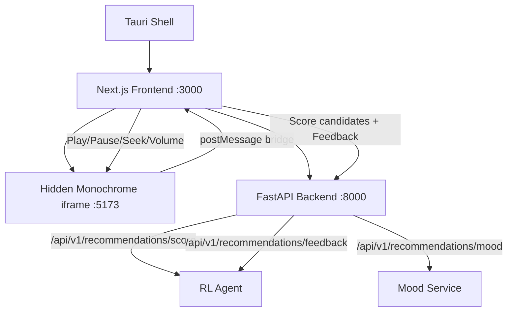

# Complete AuralFlow: AI-Driven Music Player — End-to-End

Transform the current prototype into a fully functional, standalone, AI-powered music player with every Stitch screen implemented, real data flowing end-to-end, and zero placeholder UI.

## User Review Required

> [!IMPORTANT]
> This is a **major rewrite** of the frontend. The current `page.tsx` is a single 484-line monolith with no routing, no state management, and the AI backend is completely disconnected from the UI. This plan breaks everything into proper components with Zustand stores, connects the RL agent, and implements all 7 Stitch screens.

> [!WARNING]
> The app currently has **no working navigation** — the bottom nav buttons do nothing. Search doesn't work. Library is empty. The AI scoring endpoint exists but is never called. This plan wires everything together.

## Architecture Overview



## Proposed Changes

### 1. State Management — Zustand Store

#### [NEW] `frontend/stores/playerStore.ts`
Central state for the entire app. Replaces scattered `useState` calls in `page.tsx`.

```
- activeTab: 'home' | 'search' | 'library' | 'queue'
- track: Track | null (current playing)
- playing, loading, currentTime, duration
- queue: Track[] (full playback queue)  
- queueIndex: number
- searchResults: Track[]
- searchQuery: string
- liked: Set<string>
- volume: number
- isExpanded: boolean (now-playing full screen)
- aiScores: Map<trackId, confidence> (from RL agent)
- monoReady: boolean
```

---

### 2. Monochrome Bridge — Proper Hook

#### [MODIFY] `frontend/hooks/useMonochrome.ts` (extracted from page.tsx)
Extract the `useMonochromeBridge` inline function into a proper hook file that reads/writes the Zustand store directly.

- On `af:searchresults` → write to store (no quality filter — let AI rank them)
- On `af:trackloaded` → fire `/api/v1/recommendations/mood` to get mood vector
- On `af:statechange` (ended) → fire `/api/v1/recommendations/feedback` with play stats
- On track play → fire `/api/v1/recommendations/score` to rank queue

---

### 3. AI Integration — Connect Frontend ↔ Backend

#### [NEW] `frontend/lib/api.ts`
Thin API client for the FastAPI backend:

```typescript
export async function scoreTracksAI(candidates, currentMood, recentMoods)
export async function submitFeedback(trackId, moodVector, state, feedback)
export async function computeMood(track)
```

**This is the critical missing piece.** The backend has a fully working RL agent (`ml/agents/music_rl_agent.py`) with score/feedback/mood endpoints, but the frontend **never calls them**. This wires them in:

1. When search results arrive → call `/score` with a default neutral mood
2. When a track finishes playing → call `/feedback` with play stats
3. When a track is liked → call `/feedback` with `was_liked: true`
4. Display AI confidence badges on tracks

---

### 4. Screens (Matching all 7 Stitch References)

#### Screen 1: Home — `frontend/app/page.tsx`
**Stitch refs**: "AuralFlow Home (Vision v2 + Shader)"

Rewrite to be a thin shell that renders the active tab:
- Renders `<HomeTab>`, `<SearchTab>`, `<LibraryTab>`, `<QueueTab>` based on `activeTab`
- Keeps the Monochrome iframe, ShaderBackground, BottomNav, and ControlPod
- BottomNav buttons actually switch tabs

#### [NEW] `frontend/components/HomeTab.tsx`
- Hero section with the top AI-scored track
- "Recently Played" horizontal scroll (from play history)
- "For You" section (AI-ranked recommendations)
- "Mood Flow" section showing current mood state

---

#### Screen 2: Search — `frontend/components/SearchTab.tsx`
**Stitch ref**: "AuralFlow Search (Vision v2)"

- Glass pill search input with focus border animation
- Real-time search via Monochrome bridge  
- Results grouped: Top Result (large card), Tracks, Artists, Albums
- Each result clickable → plays track
- AI confidence score shown as subtle bar on each track

---

#### Screen 3: Library — `frontend/components/LibraryTab.tsx`
**Stitch ref**: "AuralFlow Library (Vision v2)"

- Filter chips: All, Playlists, Albums, Artists, Liked
- "Liked Songs" collection from liked set
- Recently played history
- Glass cards with cover art grid

---

#### Screen 4: Queue — `frontend/components/QueueTab.tsx`  
**Stitch ref**: "AuralFlow Queue (Vision v2)"

- "Now Playing" card at top with bleed art
- "Playing Next" list with drag handles
- AI-suggested "Up Next" section with confidence scores
- Clear queue button

---

#### Screen 5: Now Playing (Full Screen) — Already exists
**Stitch ref**: "AuralFlow Now Playing (Vision v2 + Shader)"

Already built as `NowPlayingScreen.tsx`. Minor fixes:
- Stabilize waveform bars (currently re-randomize on every render)
- Connect volume slider to Monochrome bridge  
- Add swipe-down gesture to minimize

---

#### Screen 6: Album View — `frontend/components/AlbumView.tsx`
**Stitch ref**: "AuralFlow Album View (Vision v2)"

- Bleed album art header  
- Track list with numbers and durations
- "Play All" / "Shuffle" buttons
- Quality badges per track

---

#### Screen 7: Artist Profile — `frontend/components/ArtistView.tsx`
**Stitch ref**: "AuralFlow Artist Profile (Vision v2)"

- Large artist banner/photo
- Top tracks list
- Albums grid
- "Similar Artists" row

---

### 5. Fix Critical Bugs

#### [MODIFY] `frontend/components/NowPlayingScreen.tsx`
- **Bug**: Waveform bars use `Math.random()` in render → heights change on every state update. Fix by memoizing random heights with `useMemo`.
- **Bug**: Volume slider doesn't actually control Monochrome volume.

#### [MODIFY] `frontend/app/globals.css`
- Fix `body { overflow: hidden }` which prevents scrolling on the home page (currently broken).
- Add proper scroll container per-tab.

#### [MODIFY] `desktop/src-tauri/tauri.conf.json`
- Add Monochrome URL to CSP so iframe works in Tauri.

---

### 6. Data Flow Summary

| User Action | Frontend | Bridge | Backend |
|---|---|---|---|
| App loads | Search "lossless" | `af:search` → Monochrome | — |
| Results arrive | Display tracks | `af:searchresults` | `/score` → rank by AI |
| Click track | Play track | `af:play` → Monochrome | `/mood` → get mood |
| Track playing | Show progress | `af:timeupdate` every 250ms | — |
| Track ends | Auto-next | `af:statechange(ended)` | `/feedback` → train RL |
| Like track | Toggle heart | — | `/feedback(liked=true)` |
| Search | Type query | `af:search` → Monochrome | `/score` → rank results |

---

## Open Questions

> [!IMPORTANT]
> **Album/Artist detail views**: The Stitch project has designs for album and artist pages. Should I implement these as full navigable views (with back button), or defer them to a later phase and focus on the 4 main tabs (Home, Search, Library, Queue)?

> [!NOTE]
> **Settings screen**: There's a Stitch design for "AuralFlow Settings (Vision v2)" with audio quality toggles, theme options, etc. Should I include this in this phase?

## Verification Plan

### Automated Tests
```bash
cd frontend && npm run lint
cd frontend && npm run build
cd backend && source venv/bin/activate && pytest
```

### Manual Verification
1. Launch with `python start.py` — all 3 services start clean
2. Home tab populates with real tracks from Monochrome
3. Click a track → audio plays, Control Pod appears with progress
4. Click Control Pod → full-screen Now Playing expands with spring animation
5. Search tab → type query → real results appear with AI scores
6. Library tab → shows liked songs and recent history
7. Queue tab → shows current queue with AI "Up Next" suggestions
8. Bottom nav → all 4 tabs switch correctly
9. Track ends → auto-advances to next in queue
10. `python start.py --app` → Tauri desktop window loads correctly
